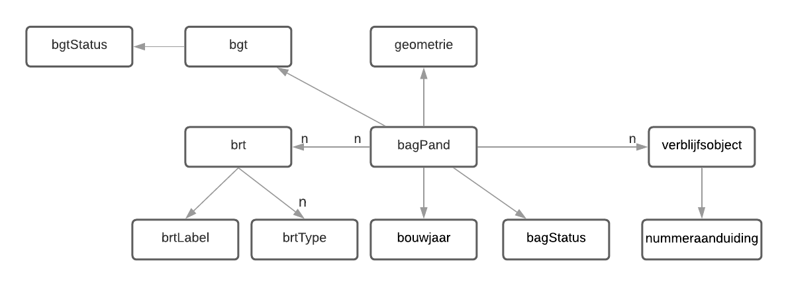

# Pandviewer

## Introduction
Pandviewer is an application that enables querying and viewing of buildings by their locations or addresses. It is a TypeScript application and uses React.

## Functionality
With pandviewer, a user can find a building and have it displayed on a map. When clicking on the building, addition information can be displayed on the pop-up. 

In general, the functionalities can be concluded by three operations: coordinate search, text search and pop up. In addtion, the user can interact with the map, such as zoom in and zoom out and switch basemap layers.

### Coordinate search
The user can search for a building by right clicking on a location on the map. After clicking, the buildings will be found, and the geometry will be drawn on the map, with a marker in the center. 
### Text search
The user can search for a building by filling in the postcode and housenumber, and click on the button 'search'. After that the building will be found, with feature and marker drawn on the map.
### Pop-up 
After getting the building object, the user can check the addition information of that building by move the mouse over the marker. After that a pop up with information from BAG, BGT and BRT dataset will appear. And the pop up is with hyperlinks to object in dataset.

## Dataset
In order to get information of buildings, three datasets are be involved:

-	Basic registration Large-scale Topography (BGT)
-	Basic Registration Addresses and Buildings (BAG)
-	Basic Registration Topography (BRT)
There datasets are stored and maintained in Triple Store. Also the sparql queries to search for the building are maintained in Triple Store. The queries are based on the services of kadaster Knowledge Graph and BGT. 

The pop-up information includes address (street name, postcode, house number...), construct year, status... These data can be retrieved by sparql query, according to the data model.
 

For detailes of the data query please check it at Triple store:

[Query for searching by coordinates](https://data.labs.kadaster.nl/jiarong-li/-/queries/PandviewerTest/19)
[Query for searching by address](https://data.labs.kadaster.nl/jiarong-li/-/queries/PandviewerSearch/3)

## Application structure

## Hooks

## Some files