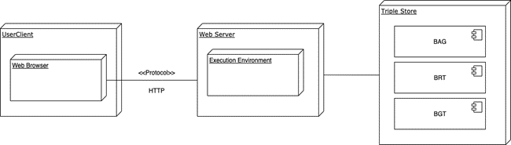

# Pandviewer

## Introduction
Pandviewer is an application that enables querying and viewing of buildings by their locations or addresses. It is a TypeScript application and uses React.

## Functionality
With pandviewer, a user can find a building and have it displayed on a map. When clicking on the building, addition information can be displayed on the pop-up. 

In general, the functionalities can be concluded by three operations: coordinate search, text search and pop up. In addtion, the user can interact with the map, such as zoom in and zoom out and switch basemap layers.

### Coordinate search
The user can search for a building by right clicking on a location on the map. After clicking, the buildings will be found, and the geometry will be drawn on the map, with a marker in the center. 
### Text search
The user can search for a building by filling in the postcode and housenumber, and click on the button 'search'. After that the building will be found, with feature and marker drawn on the map.
### Pop-up 
After getting the building object, the user can check the addition information of that building by move the mouse over the marker. After that a pop up with information from BAG, BGT and BRT dataset will appear. And the pop up is with hyperlinks to object in dataset.

## Dataset
In order to get information of buildings, three datasets are be involved:

-	Basic registration Large-scale Topography (BGT)
-	Basic Registration Addresses and Buildings (BAG)
-	Basic Registration Topography (BRT)
There datasets are stored and maintained in Triple Store. Also the sparql queries to search for the building are maintained in Triple Store. The queries are based on the services of kadaster Knowledge Graph and BGT. 

The pop-up information includes address (street name, postcode, house number...), construct year, status... These data can be retrieved by sparql query, according to the data model.

Data structure for the query:  

For detailes of the data query please check it at Triple store:

- [Query for searching by coordinates](https://data.labs.kadaster.nl/jiarong-li/-/queries/PandviewerTest/19)
- [Query for searching by address](https://data.labs.kadaster.nl/jiarong-li/-/queries/PandviewerSearch/3)

## Application architecture
This application follows the client-server architecture. The user uses the application from his web browser. And it uses the HTTP (protocol) to reach a web server.

Architecture of Pandviewer:  

The datasets and query sentence are organized in Triple Store. When the user trigger the event to start the query, it sends a request to execute the query (with paramaters as input) in server and then return the json results. Then the result is processed and displayed. 

## Functional component and hooks

The application uses the React framework. And it is driven by a functional component 'App' with many hooks.

Here are the types of hooks that is used in this application:

- useReducer  
  The useReducer accepts a reducer of type `(state, action) => newState`, and returns the current state paired with a dispatch method. In this application the state, action and reducer are defined in [reducer.ts](../src/reducer.ts), to control the behaviors.
- useEffect  
  The useEffect accepts a function that contains imperative, possibly effectful code. This hook is used when we would like to trigger a function whenever a state changes.  
- useState  
  The useState returns a stateful value, and a function to update it. It is used in the definition of input value of postcode housenumber, in order to implement the initializing and updating of the value.

## Methods

### Data access
The [searchResult.ts](../src/helpers/searchResult.ts) and [sparql.ts](../src/helpers/sparql.ts) are responsible for getting data from data store. The sparql.ts defines concrete methods to query data, and the searchResult.ts calls those methods to return the result.

- searchResult.ts
  - getFromCoordinates()
  - getFromTextSearch()
- sparql.ts
  - runQuery()
  - searchQuery()
  - queryResourcesDescriptions()
  - searchResourcesDescriptions()

#### runQuery()
This is the function to fetch the query result from the API. it returns a json result.

#### queryResourcesDescriptions()
This is the method to convert the json result into an array, also with some processing operations to tranform the types of attributes. The method has been simplified, and in order to adapt to the case of mutiple objects some changes need to be made.

#### getFromCoordinates()
This is the method to call the previous functions for a SingleObject result. And we can add `console.log` here to check the returned result.

And the searchQuery(), searchResourcesDescriptions(), and getFromTextSearch() are similar to those methods. While the previous group is for coordinate search, and the later group is for text search. There are differences on the paramters and query API.

### Application and presentation
The [App.tsx](../src/App.tsx) defines the component on the webpage, and also the used hooks.

The [leaflet.ts](../src/leaflet.ts) defines the methods for map visualization. 

The [styles.scss](../src/reducer.ts) defines the styles of elements on webpage.

## Solutions to reuse

### Case 1: To add another search module.
In this case we would like to add another search functionality, e.g, to search for a building by street name and postcode.
1. Create the query in Triple Store, make sure that the output is in the same structure as that of PandviewerTest.
2. Create a new group of functions in [searchResult.ts](../src/helpers/searchResult.ts) and [sparql.ts](../src/helpers/sparql.ts). Use the query api and change the input parameter.
3. Add a group of state, action and reducer to [reduer.ts](../src/reducer.ts) for the new search.
4. Define the event to trigger the search. If it is triggered by a button, define it in [App.tsx](../src/App.tsx).

### Case 2: To modify the pop-up information.
In this case we would like to change the pop-up information structure, e.g, to add an attribute 'oppervlakte'.
1. Create the queris in Triple Store.
2. Replace the query API in and interface SparqlResults in[sparql.ts](../src/helpers/sparql.ts). Also make changes on the queryResourcesDescriptions() and searchResourcesDescriptions() to adapt to the new structure.
3. Change the interface SingleObject in [reducer.ts](../src/reducer.ts).
4. Change the bindPopup in [leaflet.ts](../src/leaflet.ts) to display the updated information.
